# Introduction

Event manager is a component in IBM Cloud Pak for Watson AIOps. The event manager provides you the capability to monitor, troubleshoot and resolve alerts in your in your application, services, IT and network infrastructure. Event manager provides the capability to troubleshoot, resolve and act on the events directly from the provided console. 

Event manager provides the industry leading advanced event correlation. It uses algorithms like association rule-learning, temporal, spatial clustering and other machine learning (ML) algorithms. It measures accuracy, cohesion and completeness of the correlation. This, not only reduces the event flood, but also accelerates the incident diagnosis.

As part of this lab, you will be using the workstation to connect to a shared cluster to walk through some of tutorials provided here. You will be provided an user-id and password to log in to the bookmark in the provided browser.

As part of this tutorial you will 

* [Launch the console](#Launch-the-console)
* [Navigate the Event Viewer ](#Navigate-the-Event-Viewer )
* [Analytics based grouping of the events](#Analytics-based-grouping-of-the-events)  
* [Integrate with other systems](#Integrate-with-other-systems)

The event viewer URL: **https://netcool-evtmanager.think-lab-2177b-6a6ac8c3d7a0ea50590dce8fa3fd273c-0000.us-south.containers.appdomain.cloud/aiops/cfd95b7e-3bc7-4006-a4a8-a73a79c71255/**

## Launch the console

In the environment provided to you, in the desktop vm, launch the browser. Copy the URL for the **event viewer** (listed above) to the browser.

  

Use the credentials provided to you and select **Login** button.  
```
For example:
userid: user11
password: xxxxxxxxxx
```  
Once you login, you can navigate to the event viewer.  
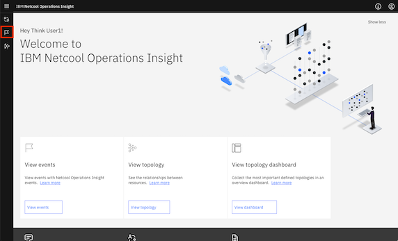  

## Navigate the Event Viewer  

Click on the flag icon which is highlighted to launch the event viewer. **Note**: change the default to Default filter.  As your user is assigned **operator** role, you will not have the capability to edit the filters and edit the views. Those icons in the console are colored blue. 


You also can act on these events further. If you scroll from left to right, you will find where these 

1. **Search Events**: You will see events that are available in the system as your user-id is provided access to list all the events. Select and click on the search icon  and type **myapp.example.com**.  This will filter the events that match the string.  To remove the search filter you can click on **x** in the search field.

      

2. **Filter Events**: In the event viewer, you can filter the events by severity. You can use the funnel icon  to select what events you want to see.   

   For example select **Critical** and **Major** events and select the **Apply filters**.   
   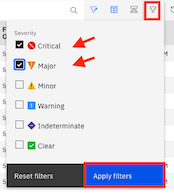  

   Now you will notice it lists only the events which are **Critical** and **Major**.  To change the view, go back to the filter icon and unselect the previously selected events and apply the filter again.  

     

3. **View the event details**: Select the event row  which has Node name as front-end-svc.myapp.example.com. **Hint**: You can search for it as listed above. This will launch the **event details** where you can act upon. You can collapse **Actions** and expand Information to view the event fields with values. You can scroll down to see the various fields with the corresponding values.    

     

## Analytics based grouping of the events

By default, out of the box, example analytics is provided. This is named as **Example_IBM_CloudAnalytics**, listed in the toolbar. This analyzes the events and correlate them depending various factors like scope based, association rule-learning, temporal, spatial clustering etc.

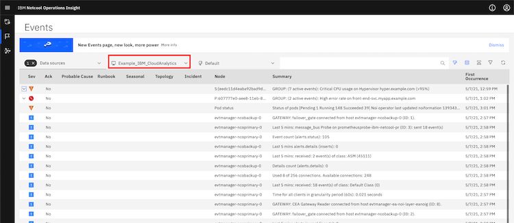

You will notice the appearance of  icon before the **Sev** column. This means that few events are grouped. You click it to display all the events that grouped, where the events are grouped against `Weekly backup started on Hypervisor hyper.example.com`.  

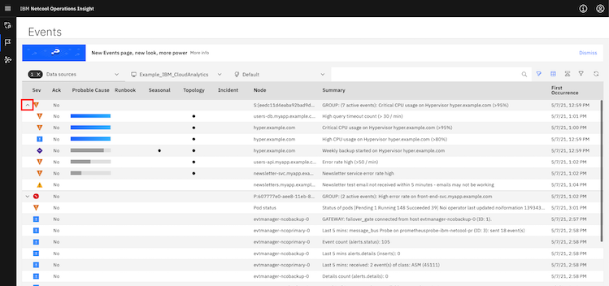  

### Event Correlation

You can drill down further on how and why these events are correlated. To see this correlation, you have to select the event correlation icon, labeled as **Correlation Information** which is highlighted below. This will add new columns to the event console.

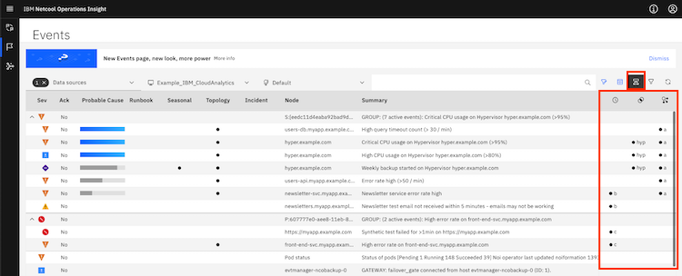  

In the above view each column represent a type a of correlation associated with the event. 

1. Column with icon  provides the temporal correlation. Events which occur briefly are all grouped together and represented here. 

   Select the first event in group which has Node value as `https://myapp.example.com`.  When you click **.d**, you will see more details on this correlation. In the details section you will when this event happened first and how many instances are grouped. This also shows the instance duration. You will see a calendar showing when this type of event occurred.

   

2. In the event viewer, select the event with node name hyper.example.com, Sev ( severity ) column with purple color, you will see a dot in the **Seasonal** colimn. This represents if the event appears periodically (like, once every week). Any events which are seasonal are represented. Once you click on the dot, you will more information.  

     

   You can toggle the view by clicking the information as highlighted above ( in red ) and vice versa.

   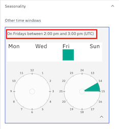  

3. Column with icon  provides the scope based event correlation. All the events that fall under a particular scope are correlated and displayed here. In the view below, you will find two types of scope based grouping. They are shown as **Err** and **hyp**. 

   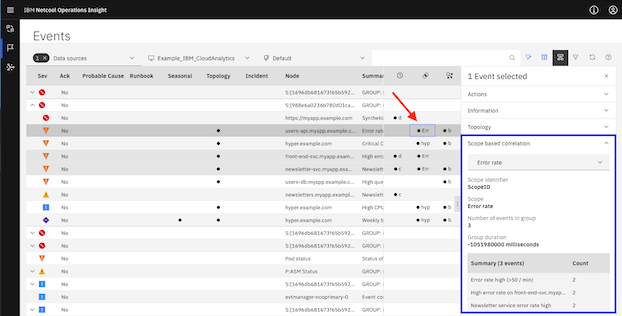  

   Once you click on the highlighted event (as pointed by red arrow), the information of the event for scope based correlation opens up. Here, you will see the scope, the number of events and their summary. You will notice the scope is based on *Error rate**. 

   Now click on event which represents scope based correlation as **hyp** in the picture to find the details of this event. 

   

   You will find the scope of this event is different than the earlier one. This event has scope for the hostname of the hypervisor itself.   

4. Column with icon  provides the topology based event correlation. If the events have properties ( for example node ) which related, then this will appear. 

   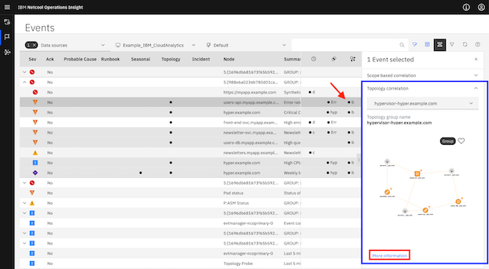  

   The topology view that appears here can be zoomed out by clicking on the **More information** link, topology viewer will be launched. You can find the topology of the environment. You can perform various actions from the topology viewer.   

   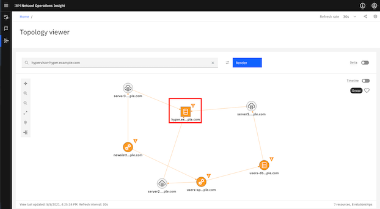

   * Resource Details: Select the node hyper.example.com, right click and select **Resource Details** will show the resource details of the node in the topology.

       

   * Timeline: Toggling the **Timeline** switch by sliding the button to other side,time shows the time of the topology. You can slide the bar below to see how the nodes in the topology change over time period. This capability will be very useful when autoscaler is in action for cloud native applications where the pods scale up and down on demand.

     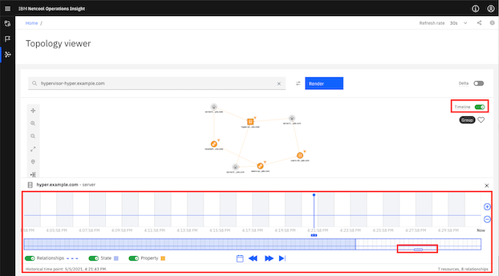

   * Delta: Similarly, you can toggle the **Delta** switch to find the topology variations between a time period. You will see a slidable pin which can be moved horizontally.

     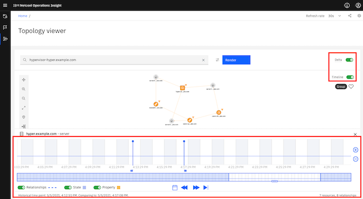  

   * Change Topology appearance: You can change the topology appearance. In the canvas of the topology you will various tools representing, zoom in, zoom out and so on. Select the topology icon and select the format you want. You will see the topology appearance changes.

     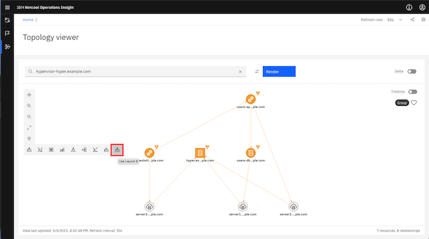 

## Integrate with other systems

As part of the integration, you can send events from many tools. List of the integrations with other systems, in addition to generic **Webhook** are listed below:

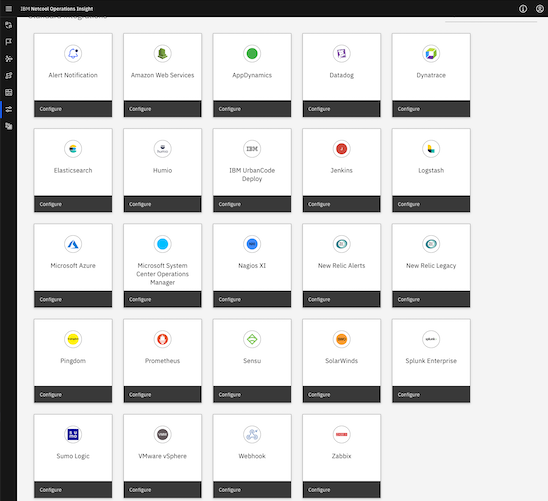  

A sample webhook is created is available for incoming events. As part of this tutorial, you will 

* Create JSON file representing an event.
* Use curl to send the created JSON file as payload to the existing webhook
* Check the event in the event viewer

### Create JSON representing a sample event

Using the provided desktop, in a command terminal using vim or vi create file  

```
vi userXX.json

Note: Replace userXX with the user-id assigned to you.
      For example user11.json
```  

Now copy the content to the file.  

```  
{
    "issue": {
        "id": "jfjNHG5eTFKTWEic4vuO3Q",
        "type": "issue",
        "state": "OPEN",
        "start": 1614249367000,
        "severity": 10,
        "text": "Condition [Ready]: ContainersNotReady",
        "suggestion": "containers with unready status: [mongodb]",
        "link": "https://pirsoscom.github.io/INSTANA_SUMMARY_NOK_ROB.html",
        "entityType": "Kubernetes Pod",
        "customZone": "not available",
        "availabilityZone": "not available",
        "zone": "not available",
        "fqdn": "not available",
        "entity": "Kubernetes Pod",
        "entityLabel": "robot-shop/userXX-mongodb-2332-2335 (pod)",
        "tags": "not available",
        "container": "userXX-mongodb",
        "service": "catalogue",
        "containerNames": []
    }
}

Note: Replace userXX with the user-id assigned to you.
      For example user11.json
```  

As you are going to use the same terminal window to run the curl command, you need set a vaiable for the webhook URL and then run the curl command as show below.  

```
export WEBHOOK_URL=https://netcool-evtmanager.apps.ahsoka.coc-ibm.com/norml/webhook/webhookincomming/cfd95b7e-3bc7-4006-a4a8-a73a79c71255/14f8f86c-af03-47ac-83e8-6fe54279afdd/IS1Yxz5_YvwQ24mhNcFqa_PifAUNbavGuuwd0VD9UWU

curl -XPOST -H "Content-type: application/json" -d @./userXX.json $WEBHOOK_URL 

Note: Replace userXX with the user-id assigned to you.
      For example user11.json
```

As the webhook is receiving the events, you will see an output similar to  

```
{"deduplicationKey":"739d1cecc698f59cb5e368c73b682189","eventid":"791bb600-aecd-11eb-a49d-39ebaf15bf05"}
```

Now, you can validate if the event is created. In the event viewer, refresh the events . As this is a shared environment, you may view similar events with a different **Node** name as every user uses the user-id as prefix.

Search for events with name **userXX-mongodb** ( Example: if your user-id is user11, search for user11-mongodb). You will find that the event is created by you via webhook.  

  

## Conclusion

As part of this tutorial, you navigated the event viewer. You experienced how the Analytics are applied and grouped the events. You walked through the various event correlations and saw how easy it is to integrate with other systems. 


I

