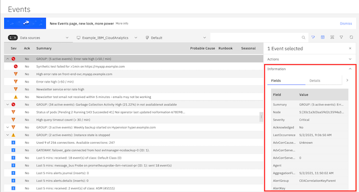
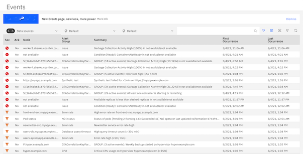
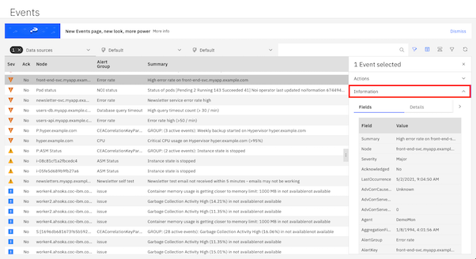

# Introduction.

One of the analytical capabilities built into the event manager is the event grouping which "reduces the noise". As part of this tutorial, you will:

* [Launch the console.](#Launch-the-console)
* [Group the events.](#Group-the-events)
* [Navigate the event viewer.](#Navigate-the-event-viewer)

## Launch the console.

In the environment provided to you, in the desktop VM, launch the browser and select the bookmark **EventManager-Console**.


Use the provided credentials and click on the **Login** button. For example:
```
userid: user1
password: **********
```

Once you log in, you can navigate to the event viewer.


## Group the events.

By default, out of the box, example analytics is provided. Its name is **Example_IBM_CloudAnalytics**, and it is listed in the toolbar. It analyzes the events and groups them where their rate is high (greater than 50 per minute).
> Note/TODO: **Document why the events are grouped**

You will notice the icon  immediately before the **Sev** column. It means that a few events are grouped. Click on it to expand and display all the grouped events.


You can view why the events are grouped together. Select the event which has **Group:** in the summary column to display the information.



## Navigate to the event viewer.

Click on the highlighted flag icon to launch the event viewer.
> **Note**: change the default to Default filter.

As your user is assigned to **operator** role, you will not have the capability to edit the filters or views. Those icons in the console are colored in blue.


In this view, you can get accustomed to:

1. **Search Events**: You will see available events in the system as your user-id is provided with access to list all of them. Select and click on the search icon  and type: `myapp.example.com`. It will filter the events that match the string. To remove the search filter, you can click on the **x** of the search field.


2. **Filter Events**: In the event viewer, you can filter the events by severity. You can use the funnel icon  to select which events you want to examine. For example, select **Critical** and **Major** events and click on the **Apply filters**.


Now you will notice it lists only the events which are **Critical** and **Major**. To change the view, go back to the filter icon and unselect the previously selected events and apply the filter again.



3. **View the event details**: Select the event row with Node name as `front-end-svc.myapp.example.com`.
> **Hint**: You can search for it as listed above. It will launch the **event details** where you can act upon.

You can collapse **Actions** and expand **Information** to view the event fields with values. You can scroll down to see the various fields with the corresponding values.

